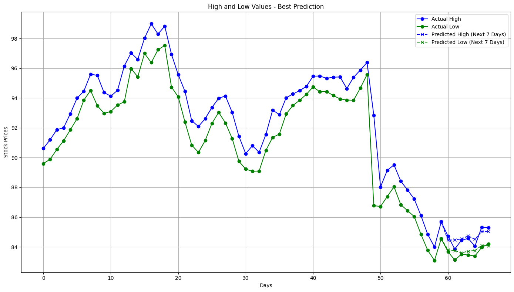

# Stock Predictor Model
The Stock Predictor Model is a machine learning project that leverages a Bidirectional LSTM (BiLSTM) architecture to forecast stock prices. The model predicts the high and low prices for the next seven days based on 60 days of historical stock data and sentiment analysis of associated news headlines.

This project is ideal for those interested in time series forecasting, financial data analysis, and the integration of multiple data sources for enhanced predictive capabilities.

## Features
- **Time Series Forecasting**: Predicts high and low stock prices for a 7-day period.
- **Multi-Input Data Integration**: Combines 60 days of stock data (open, high, low, close, volume) with sentiment analysis of news headlines.
- **Bidirectional LSTM Architecture**: Utilizes advanced BiLSTM layers to capture temporal dependencies in both directions.
- **Regularization**: Incorporates L2 regularization and dropout layers to prevent overfitting.
ReLU Activation: Ensures non-linear learning capabilities and outputs meaningful predictions.

## Model Architecture
The model is built using TensorFlow and has the following architecture:

``` python
model = tf.keras.Sequential([
    tf.keras.layers.InputLayer(shape=input_shape),
    tf.keras.layers.Bidirectional(tf.keras.layers.LSTM(64, return_sequences=True, kernel_regularizer=regularizers.l2(0.001))),
    tf.keras.layers.Dropout(0.2),
    tf.keras.layers.Bidirectional(tf.keras.layers.LSTM(32, return_sequences=True, kernel_regularizer=regularizers.l2(0.001))),
    tf.keras.layers.Dropout(0.2),
    tf.keras.layers.Bidirectional(tf.keras.layers.LSTM(32, kernel_regularizer=regularizers.l2(0.001))),
    tf.keras.layers.Dense(14, activation='relu'),  # Output layer with 14 neurons
])

optimizer = Adam(learning_rate=0.001)
model.compile(optimizer=optimizer, loss='mse')
```

### Key Components:
- **Input Layer**: Accepts a tensor of shape (batch_size, 60, features).
- **BiLSTM Layers**: Extract temporal features from time series data in both forward and backward directions.
- **Dropout Layers**: Randomly drops units during training to prevent overfitting.
- **Dense Layer**: Outputs 14 values corresponding to 7 days of predicted high and low stock prices.
- **Loss Function**: Mean Squared Error (MSE).
- **Optimizer**: Adam optimizer with a learning rate of 0.001.

## Data Preprocessing
### Input Data:
- **Stock Data**: 60 days of Open, High, Low, Close, and Volume values.
- **News Sentiment**: Sentiment scores for 7 days of news headlines. Missing data is padded with zeros.

### Preprocessing Steps:
1. **Normalization**: Stock data is normalized by dividing each feature by its maximum value to scale the data to a [0, 1] range.
    ``` python
    nopen_data = open_data / np.max(open_data)
    nhigh_data = high_data / np.max(high_data)
    nlow_data = low_data / np.max(low_data)
    nclose_data = close_data / np.max(close_data)

    ```
2. **Zero Padding**: Sentiment data for missing days is padded with zeros to align with input dimensions.
3. **Feature Engineering**: Combines stock and sentiment data into a unified input format.

## Training
### Parameters:
- **Epochs**: 50.
- **Batch Size**: 16.
- **Validation Split**: 20% of the data is used for validation.
- **Regularization**: L2 regularization with a factor of 0.001 to reduce overfitting.

### Training Results:


## Usage
### Running the Model:
To train the model, prepare the data as specified and execute the training script. Ensure TensorFlow and necessary dependencies are installed.

### Prediction:
Load the trained model and provide new data in the required format to get predictions for the next 7 days. Example:

``` python
predictions = model.predict(new_data[:,4:,:])
```

### Post-Processing:
Denormalize predictions by multiplying the predicted high and low values by the maximum values from the respective stock data:

``` python
predicted_high = predicted[:7] * np.max(input_data[1])
predicted_low = predicted[7:] * np.max(input_data[2])
```

## Best Predictions
For an example of how well the model can perform, see the images comparing the model's predicted stock prices against the actual stock prices for selected examples:




These images provide a visual comparison of the model's predictions against real-world data.

## Improvements and Limitations
### Improvements:
- Consider fine-tuning the model for stocks with extreme values by implementing dynamic normalization techniques.
- Incorporate additional features, such as sector trends or macroeconomic indicators.

### Limitations:
- Struggles with generalization for stocks outside the typical range of training data.
- Assumes availability of high-quality sentiment analysis data.

## Contributing
Contributions are welcome! Please open an issue or submit a pull request for any suggestions or improvements.

### References
- **Sentiment Analysis**: [My Finance Sentiment Analyzer](https://github.com/MatthewW05/FinanceSentimentAnalyzer)
- **Stock Data**: [Yahoo Finance](https://ca.finance.yahoo.com/), [yfinance](https://github.com/ranaroussi/yfinance)

### License
This project is licensed under the MIT License. See the [LICENSE](./LICENSE) file for details.